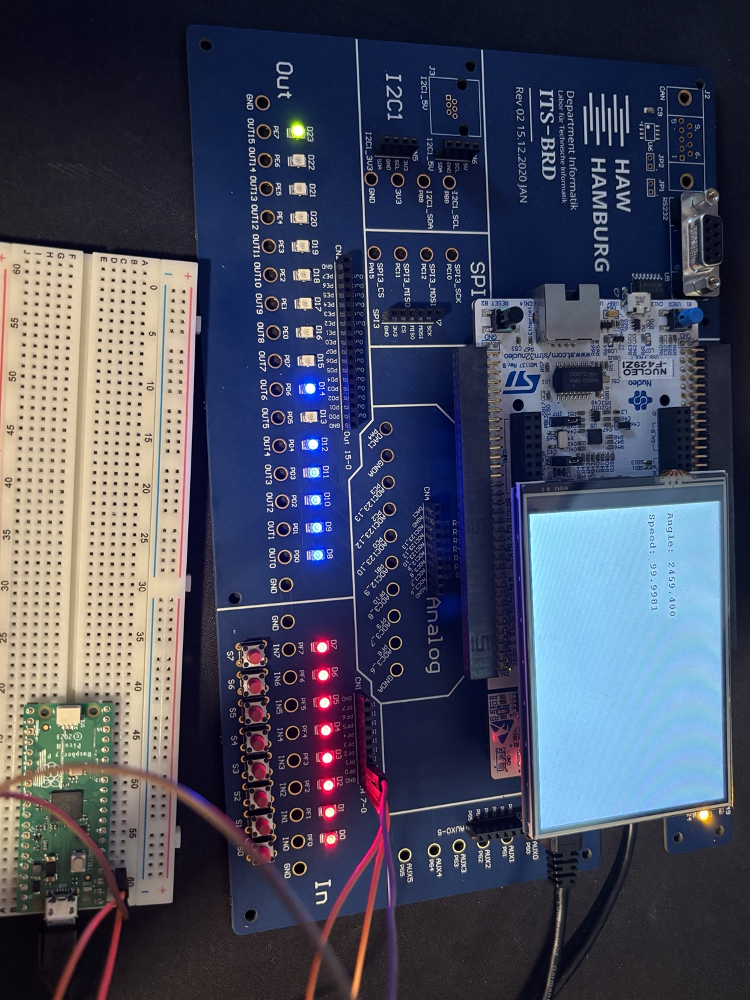
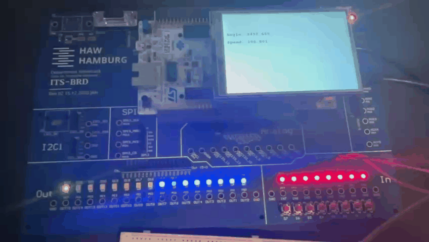

# Embedded Rotary Encoder System

Implementation of a rotary encoder evaluation system in C for the HAW Hamburg ITS Board.

The project evaluates quadrature encoder signals using polling and a finite state machine (FSM). Based on the detected phase transitions, the system determines rotation direction, angular position and angular velocity.

## Features

* Finite State Machine (FSM) for encoder state evaluation
* Detection of clockwise and counterclockwise rotation
* Error detection for invalid phase transitions
* Angular position calculation
* Angular velocity calculation
* LCD output of angle and angular velocity
* GPIO-based LED status indicators
* Modular software architecture

## Hardware Setup

The project was developed for the HAW Hamburg ITS Board.

During development and testing, the rotary encoder signals were generated by a Raspberry Pi Pico based square-wave generator that simulates the quadrature signals of a rotary encoder. The generated signals are phase shifted by 90° and can emulate both rotation directions.

## Software Architecture

### FSM Module

Responsible for:

* Encoder state tracking
* Phase transition evaluation
* Direction detection
* Error handling
* Pulse counting

### GPIO Module

Responsible for:

* Reading encoder inputs
* Updating status LEDs

### Time Module

Responsible for:

* Timestamp generation
* Time difference calculation

### Computing Module

Responsible for:

* Angle calculation
* Angular velocity calculation

### Display Module

Responsible for:

* LCD output
* User feedback

## Technical Concepts

This project demonstrates:

* Embedded Software Development
* Finite State Machines (FSM)
* Quadrature Encoder Signal Processing
* Real-Time Data Processing
* Modular Software Design
* Hardware Abstraction
* Polling-Based Input Processing

## Assignment Requirements

The implementation fulfills the main requirements of the university assignment:

* Polling-based encoder evaluation
* Finite State Machine based state management
* Direction-aware pulse counting
* Angle calculation
* Angular velocity calculation
* Error detection and reset handling
* Modular architecture following Separation of Concerns principles

## Demonstration

The project was tested using a Raspberry Pi Pico based quadrature signal generator.

### Setup

### Demo

## Project Status

Completed university project. The code is uploaded for portfolio and documentation purposes.

## Author

Ben Brandenburg

Developed as part of the Computer Science program at HAW Hamburg.

